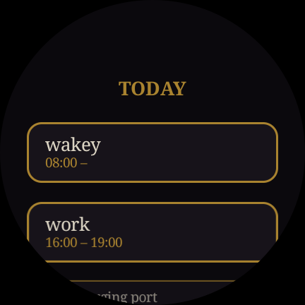

# Calendar on da Watch — Wear OS app

Wear OS (Kotlin + Compose) app for Galaxy Watch 6.

- Shows today's events, from Firestore
  (`calendar/main`)
- Every night at 23:59, reads **tomorrow's** events and arms an
  alarm for each
- Re-arms after each boot



## Before building

1. **Firestore — set up.** `CalendarRepository.kt`
   Data:
   ```
   calendar/main
     entries: {
       "2026-6-12": [                 <- NOT zero-padded (year-month-day)
         { id: "...", title: "Work", startTime: "06:30", endTime: "14:30", note: "" },
         ...
       ]
     }
   ```

2. **Firestore read access** The watch app reads only
   `firestore.rules` — `request.auth != null`

3. **`google-services.json`.** In Firebase console for the project, add another app registration — 
   **Android**, package name `com.ledger.calendarwatch` (or whatever 
   `applicationId` is in `app/build.gradle.kts`). Download
   `google-services.json` and drop it in `app/`.

4. **Package name / app name.** Change `com.ledger.calendarwatch`
   for different package id, and change `app_name` in
   `res/values/strings.xml`.

## Build

Open `projects_name/` folder in Android Studio (Koala or newer),
let Gradle sync, then:
- run a Wear OS emulator (Watch6-class, API 34), or
- enable ADB + wireless debugging on watch (`adb pair <watch-ip>:5555`).

## Known limitations / notes

- **external app** Full-screen, sound+vibration notification 
- **Battery optimization.** adaptive battery can
  kill background alarms. Exclude this app from battery
  optimization if doesn't activate at 23:59
